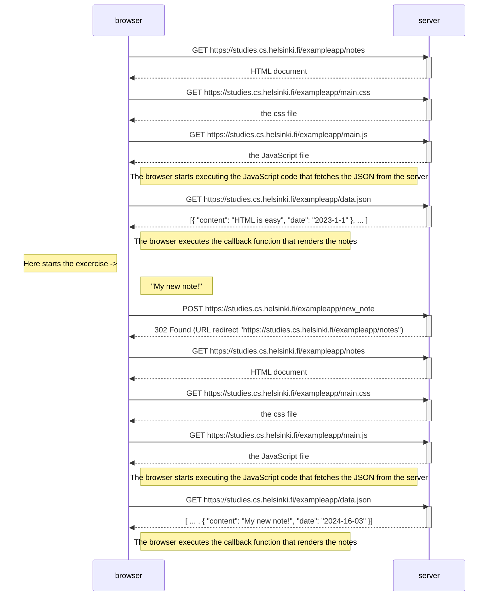

# 0.4: New note diagram

In the section Loading a page containing JavaScript - review (https://fullstackopen.com/en/part0/fundamentals_of_web_apps#loading-a-page-containing-java-script-review), the chain of events caused by opening the page https://studies.cs.helsinki.fi/exampleapp/notes is depicted as a sequence diagram

Create a similar diagram depicting the situation where the user creates a new note on the page https://studies.cs.helsinki.fi/exampleapp/notes by writing something into the text field and clicking the Save button.

## Flowchart

